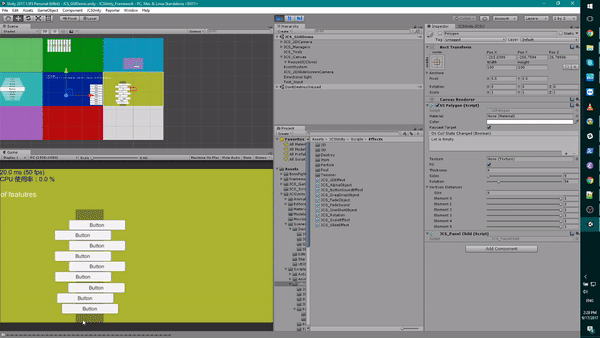
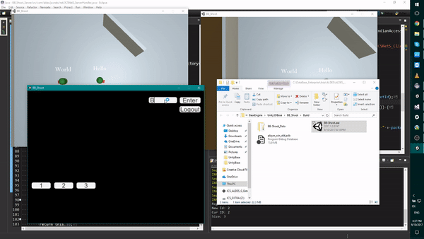

# JCSUnity #
 

JCSUnity is a general speed components framework. JCSUnity help out
people who have trouble making script/component over and over agian
in variety of different project. This framework provide many scripted
game mechanics. With those combination of scripts/components could
generate enormous variety of different behaviour.   

## How to use it? ##
JCSUnity is like other Unity plugins. You can download the latest 
release from the above tab, or from the link 
<a href="https://github.com/jcs090218/JCSUnity_Framework/releases/download/1.6.3/JCSUnity_Release_v1.6.3.unitypackage" target="_blank">
here</a>. Simply create a new project in Unity then import all of 
the assets into that project. Then you can start all of the tools 
in the JCSUnity framework.  

## Notice ##
All media assets inside JCSUnity do not fall under its license. 
These assets are placeholders only, and should only be used for 
testing purposes. They are NOT, under any circumstances, to be 
used commercially. By using this framework you agree to these 
terms, and understand that you are solely responsible for any 
legal action taken against you for using, or attempting to use 
any placeholder assets commercially.
 

## Overview ##

### Create Scene with JCSUnity ###
Create the simple scene with smooth switching the scene and smooth
switching the background music is always painful. Not because is
hard but is work that you will have to do for mostly every project. 
I made the 'JCSUnity' editor for just one click so you could have
nice switching scene UI and background music. Background music can
be switch at 'JCS_Settings' object to 'JCS_SoundSetting' component 
in the scene. Scene relative variables can be found at 'JCS_Settings' 
object 'JCS_SceneSetting' component. 

### Auto Resize ###
I use to hate drag and move the anchor point around when dealing
with different resolutions in Unity UI system. Although, this
cost a bit of performance at initialize time, I think is worth it to
have this feature because I will never have to drag the anchor point
around everytime I start a new project or create a new panel in the 
scene.  

### GUI System ###
Since Unity version 4.6, they have release nice uGUI system, but 
with lack of cool effect and sound on there. Here are some simple
effect I made so you can simple make game with details.  

### Network Module ###
I have never use Unity's network module, but I heard a lot of people
complain how bad Unity handle networking/socket programming. I provide
the basic client side TCP and UDP socket class and some switch 
port/host function, so you can use it with the server side code that 
you confortable with.  

### Dialogue System ###
Do you ever had an issue implementing dialogue in Unity? Here is basic
dialogue system which is easy to customize. You can control the text
scroll speed and all the images' position. Just inherent 'JCS_DialogueScript'
class to design you own dialogue! You can test your script in 'JCS_ScriptTeseter'
scene.  

### In Game Log System ###
Log system inside the game.  

## Demo ##
* https://www.youtube.com/playlist?list=PLZgPIJqrkb83SBfBSzk0SMchegZFO9lKI

## Games ##

