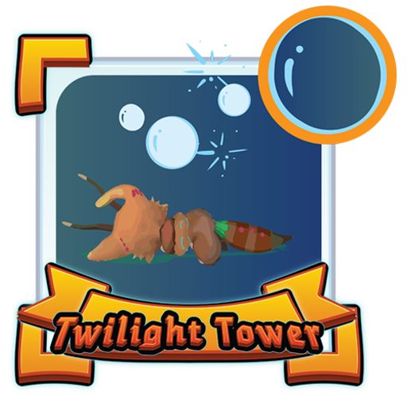
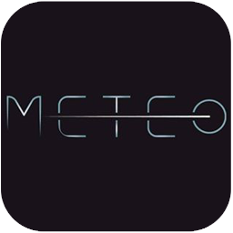

# JCSUnity

JCSUnity is a component driven framework built to allow the user
to quickly generate commonly used game mechanics and features
such as UI functionality and player movement. This will allow
for a faster initial development. Most components work individually
while other components must be used in tandem with others.
Individually components can be combined to create new behaviors.

## 💥 Important Notice

All media assets inside JCSUnity do not fall under its license.
These assets are placeholders only, and should only be used for
testing purposes. They are NOT, under any circumstances, to be
used commercially. By using this framework you agree to these
terms, and understand that you are solely responsible for any
legal action taken against you for using, or attempting to use
any placeholder assets commercially.

## 📰 News

Here is the list of few important and recent changes to this framework.

- `2.3.1` - Use [MyBox](https://github.com/Deadcows/MyBox) to organize variables.
- `2.3.0` - Fixed resizable screen's calculation in perspective mode.
- `2.2.1` - Implement new screen type, `MIXED` for responsive UI.
- `2.2.0` - Add `trimmed` version to release.
- `2.1.2` - Add support for multiple languages.
- `2.1.1` - Add support for safe area view for iPhone X or above.
- `2.1.0` - Multiple minor fix for screen module for resizable screen feature.
- `2.0.7` - Support consistent streaming assets loading with web request.
- `2.0.6` - Updated project to Unity version `2020.1.0f1`.
- `2.0.5` - Supplied full version of `webcam` module.

## 🔨 How to use it?

JCSUnity is like other Unity plugins. You can download the latest
release from the above tab, or from the link
[here](https://github.com/jcs090218/JCSUnity/releases/latest)
. Simply create a new project in Unity then import all of
the assets into that project. Then you can start all of the tools
in the JCSUnity framework.  

## 🏆 Features

So, what does this framework does? Check out the
[features](https://github.com/jcs090218/JCSUnity/tree/master/features)
directory at the root of the project directory.

## 📌 Dependencies

These are libraries `JCSUnity` uses. Consider the usage, some plugins
aren't necessary depend on the game your are making.

- [MyBox](https://github.com/Deadcows/MyBox) - is a set of attributes, tools and extensions for Unity
- [Tweener](https://github.com/PeterVuorela/Tweener) - Simpler and light weight tweener library.
- [In-game Debug Console](https://assetstore.unity.com/packages/tools/gui/in-game-debug-console-68068) - Easier debugging after built.
- [StandaloneFileBrowser](https://github.com/gkngkc/UnityStandaloneFileBrowser) - File browser for UI/tool base application.
- [UI-Polygon](https://github.com/CiaccoDavide/Unity-UI-Polygon) - Geometry shape UI renderer interface.

## 🔗 Links

- *Demo* : https://www.youtube.com/playlist?list=PLp13qyXnE6zDioC30eW_-aqr4gsswxJo0
- *Tutorials* : https://www.youtube.com/playlist?list=PLp13qyXnE6zCmRobHV9uEjv-1_ieCPwjc
- *Manual/Scripting API* : [Scripting-Manual-JCSUnity](https://jcs090218.github.io/JCSUnity/Manual/index.html)

## 🎮 Showcase

Here is a list of applications that are made with JCSUnity.

