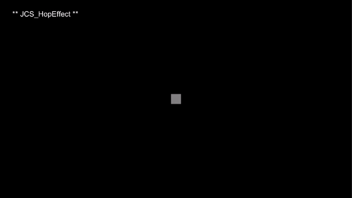

# JCS_HopEffect

Make object hop for a force.

## Variables

| Name      | Description                                         |
|:----------|:----------------------------------------------------|
| onStart   | Exection after we just start hopping.               |
| onDone    | Exection after we are done hopping.                 |
| mForce    | How much force to jump away from current position.  |
| mGravity  | How fast the object goes back to original position. |
| mAxis     | Hop axis.                                           |
| mTimeType | Type of the delta time.                             |

## Functions

| Name     | Description                |
|:---------|:---------------------------|
| StartHop | Start the hopping process. |

## Demo

