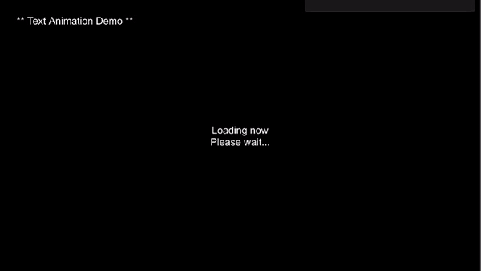
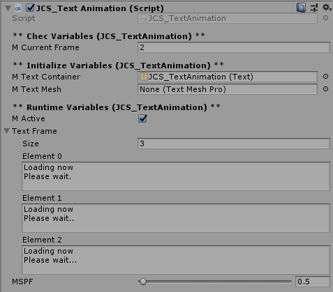

# JCS_TextAnimation

Text animation that will display text accordingly.

## Variables

| Name           | Description                      |
|:---------------|:---------------------------------|
| mActive        | Animation active or not active.  |
| textFrame      | Hold all text animation's frame. |
| mSPF           | Seconds per frame.               |
| mTimeType      | Type of the delta time.          |

## Functions

| Name            | Description            |
|:----------------|:-----------------------|
| UpdateTextFrame | Update the frame text. |

## Demo

## Inpsector View

