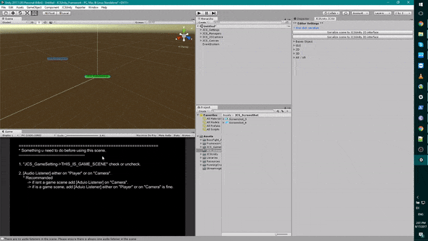

# Create Scene with JCSUnity

Create the simple scene with smooth switching the scene and 
smooth switching the background music is always painful. Not 
because is hard but is work that you will have to do for mostly 
every project. I made the `JCSUnity` editor for just one click 
so you could have nice switching scene UI and background music. 
Background music can be switch at `JCS_Settings` object to 
`JCS_SoundSetting` component in the scene. Scene relative variables 
can be found at `JCS_Settings` object 'JCS_SceneSetting' component.
 

