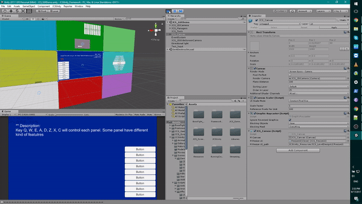

# Auto Resize

I use to hate drag and move the anchor point around when dealing
with different resolutions in Unity UI system. Although, this
cost a bit of performance at initialize time, I think is worth it to
have this feature because I will never have to drag the anchor point
around everytime I start a new project or create a new panel in the
scene.

