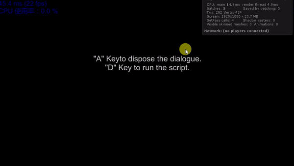

# Dialogue System

Do you ever had an issue implementing dialogue in Unity? Here is basic
dialogue system which is easy to customize. You can control the text
scroll speed and all the images' position. Just inherent 'JCS_DialogueScript'
class to design you own dialogue! You can test your script in 'JCS_ScriptTeseter'
scene. 
 

